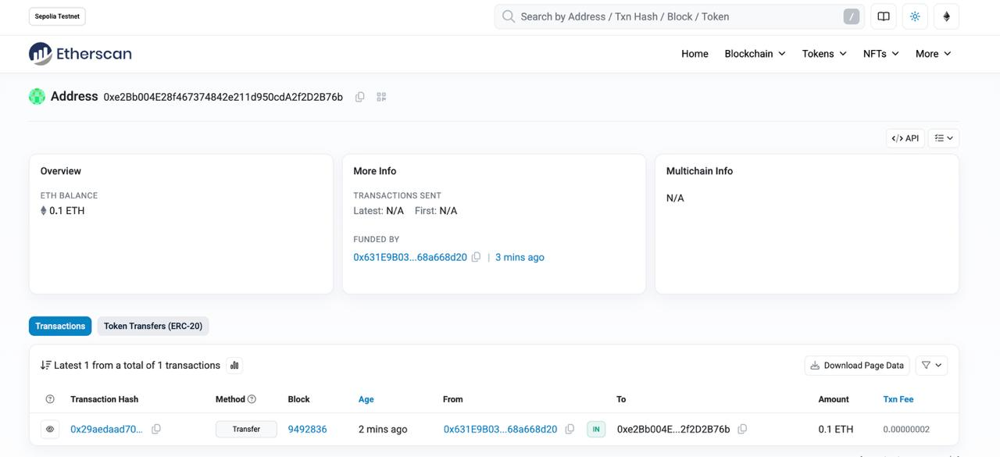
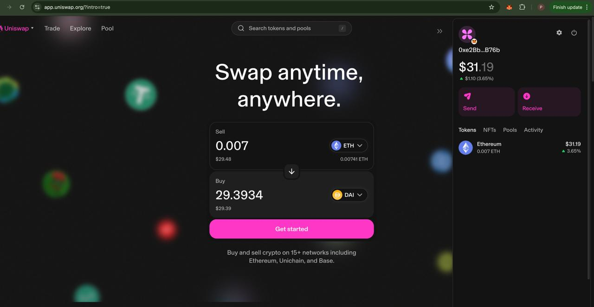
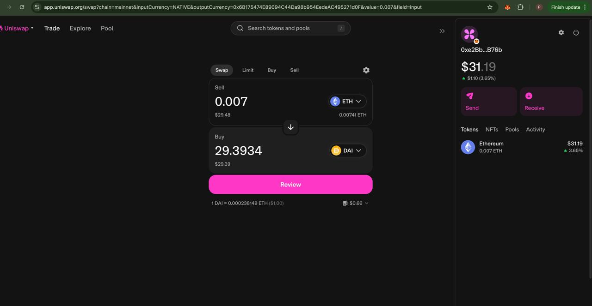
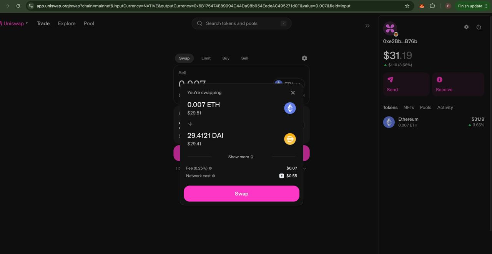
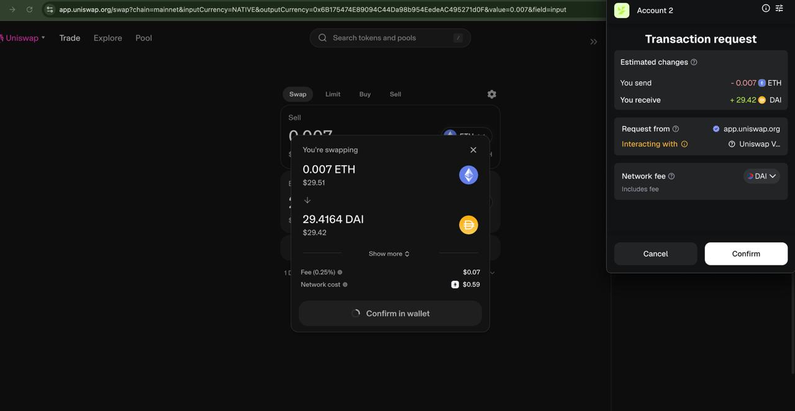
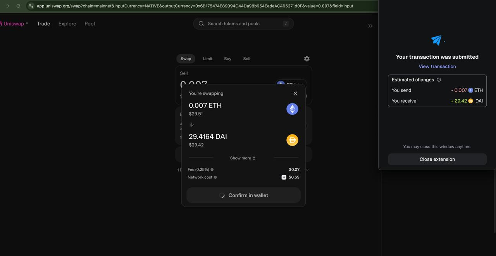

# Web3 Basics: Hands-On Blockchain Learning

## Objective
The objective of this task was to gain a foundational understanding of blockchain technology, Web3 concepts, and decentralized applications (DApps) through practical, hands-on experience.  
This included setting up a crypto wallet, obtaining testnet tokens, and performing a DApp interaction.

---

## Implementation Steps

### 1. Learn Blockchain Basics
I began by studying blockchain architecture, distributed ledger technology, consensus mechanisms such as Proof of Work and Proof of Stake, and the role of cryptography in maintaining blockchain integrity.  
I also learned about smart contracts and how they automate processes on-chain.

---

### 2. Set Up Crypto Wallet
I installed the MetaMask browser extension from the official website: [https://metamask.io](https://metamask.io).  
After creating a wallet, I securely stored my seed phrase offline.  
I configured MetaMask to connect to the **Ethereum Sepolia testnet** and also set it up for the **Ethereum Mainnet** for real DApp interactions.

---

### 3. Obtain Testnet ETH
I accessed the **Sepolia Faucet** to receive testnet ETH in my wallet.  
The transaction can be verified on Etherscan using this address:  
👉 [https://sepolia.etherscan.io/address/0xe2bb004e28f467374842e211d950cda2f2d2b76b](https://sepolia.etherscan.io/address/0xe2bb004e28f467374842e211d950cda2f2d2b76b)

**Transaction Proof Screenshot:**  

---

### 4. Interact with a DApp (Mainnet)

this is mainnet address swap proof: 👉  [https://etherscan.io/tx/0x1b8d6c9b1a65d2569077dd031c62ff2ef351a1caa574ecf36e51a0ad3af7530f](https://etherscan.io/tx/0x1b8d6c9b1a65d2569077dd031c62ff2ef351a1caa574ecf36e51a0ad3af7530f)

As both **Uniswap** and **OpenSea** testnets are currently unavailable, I used the **Ethereum Mainnet** to complete the DApp interaction.  OpenSEA testnet closed proof:- [https://support.opensea.io/en/articles/11833955-farewell-testnets](https://support.opensea.io/en/articles/11833955-farewell-testnets)
I added **$31 worth of ETH** to my MetaMask wallet and performed a **swap transaction to DAI**, following the same process as originally instructed for the testnet.

#### Uniswap Mainnet Swap Process:
1. **Connect Wallet**  
   

2. **Select Token Before Swap**  
   

3. **Review Transaction**  
   

4. **Swap Execution**  
   

5. **MetaMask Confirmation**  
   

All transactions were verified through Etherscan, and the screenshots above document the full swap process clearly.

---

### 5. Documenting Learning and Observations
Throughout this task, I captured screenshots of each key step — wallet setup, faucet transaction, testnet balance verification, and the Uniswap swap operation.  
The screenshots display Etherscan confirmations and transaction hashes for both Sepolia and Mainnet transactions.

---

## Reflection
Through this activity, I learned how blockchain differs from traditional databases in being **decentralized, transparent, and immutable**.  
Smart contracts act as self-executing agreements that ensure **trustless** transactions without intermediaries.  
The MetaMask wallet experience emphasized the importance of **private key security** and phishing awareness.  
Performing real swaps on Mainnet gave me hands-on experience with **gas fees, transaction times,** and **confirmation processes**.

---

## Technical Summary
- **Testnet Used:** Sepolia  
- **Mainnet Used:** Ethereum  
- **DApp Interacted:** Uniswap (Mainnet)  
- **Transactions Performed:** ETH → DAI Swap on Mainnet  
- **Testnet Transaction or test token added proof:** [https://sepolia.etherscan.io/address/0xe2bb004e28f467374842e211d950cda2f2d2b76b](https://sepolia.etherscan.io/address/0xe2bb004e28f467374842e211d950cda2f2d2b76b)  
- **Approximate Mainnet ETH Used:** $31 worth  

---

## Expected Outcomes
By completing this task, I gained:
- A clear understanding of blockchain and Web3 fundamentals  
- Practical experience in **setting up MetaMask** and interacting with decentralized applications  
- The ability to interpret on-chain data through **Etherscan**  
- Hands-on learning with **real transaction execution** and wallet management  

---

### Note
Due to the unavailability of Uniswap and OpenSea testnets, the **Ethereum Mainnet** was used for completing the swap.  
All sensitive information such as private keys and seed phrases has been kept secure and is **not included** in this document.
